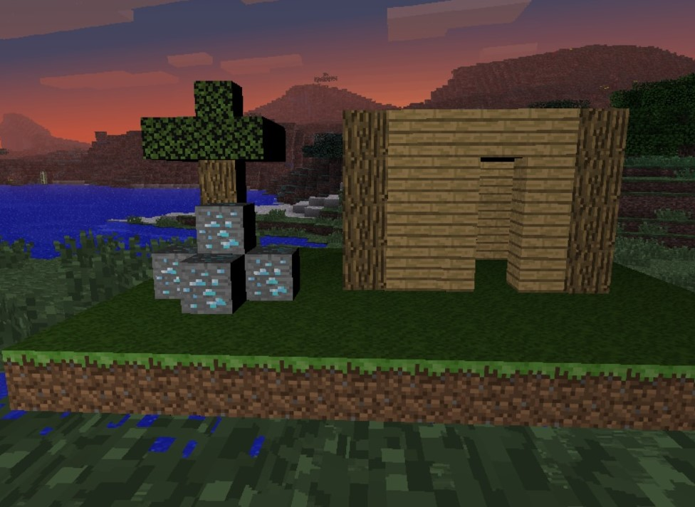
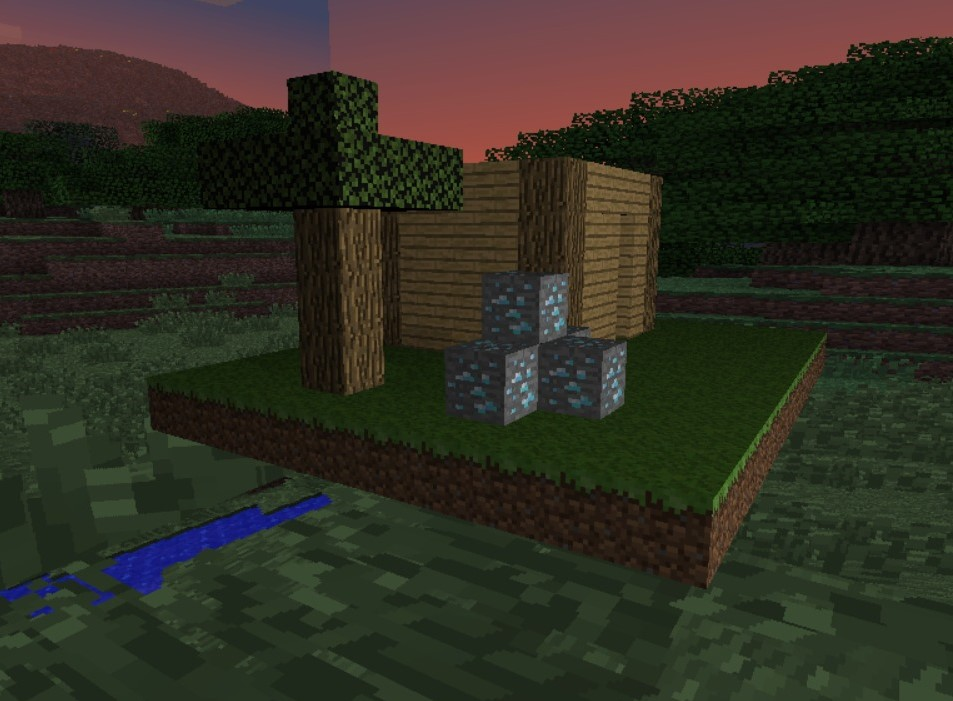
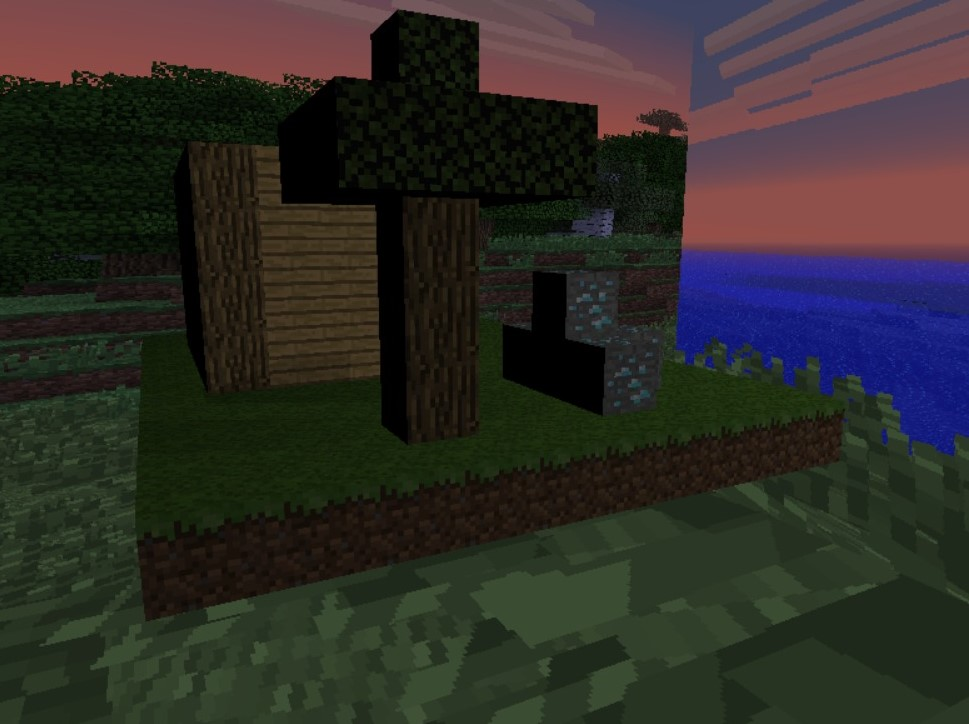

# Proyecto 3: Raycasting
Diorama de Minecraft con raycasting implementado. 

## Objetivos
- Crear una escena visualmente atractiva que haga uso de raycasting.
- Implementar materiales con distintos atributos para su reflexión, refracción y transparencia.

# Diorama

# Video del diorama
https://github.com/senioritosly/Proyecto3-Graficas/assets/88349168/8b4506ff-1d7a-4a0a-b8b2-34a8b31c3448

## Controls

| Action             | Control                                                                |
| ----------------- | ------------------------------------------------------------------ |
| Movement | ARROWS |
| Camera Horizontal | A, D |
| Camera Zoom In & Zoom Out | W, S |

#### Rúbrica

| Puntos | Descripción                     |
| :-------- | :-------------------------------- |
| `30 pts`              | Por qué tan compleja sea su escena |
| `20 pts`              | Por qué tan visualmente atractiva sea su escena |
| `20 pts`              | Por implementar rotación en su diorama y dejar que la camara se acerque y aleje |
| `20 pts`              | Por cada material diferente que implementen, para un máximo de 5. (Grass, oak log, oak plank, diamond ore, leaves) |
| `20 pts`              | Por implementar un skybox para su material |
| `10 pts`              | Por implementar refracción en al menos uno de sus materiales |

**Total:** 120 pts
